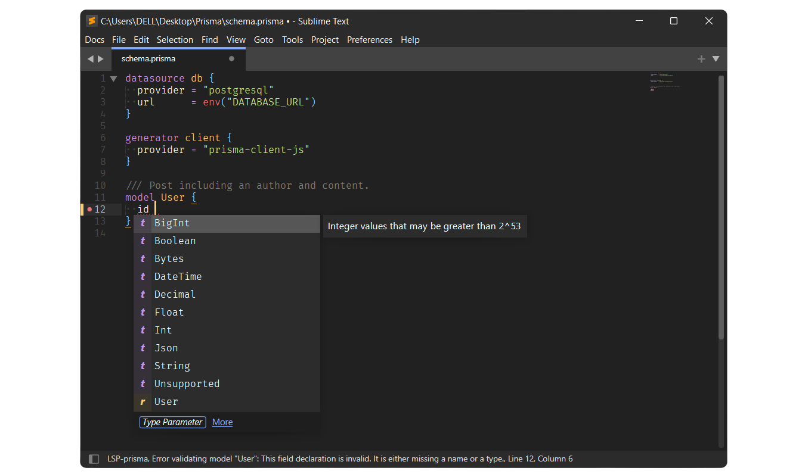

# LSP-prisma

   

`LSP-prisma` is a LSP helper package for the [Prisma Language Server](https://github.com/prisma/language-tools/tree/main/packages/language-server). `LSP-prisma` on it's own doesn't do anything. It acts as a glue between the `LSP` package and the [Prisma Language Server](https://github.com/prisma/language-tools/tree/main/packages/language-server). It takes care of downloading, configuring & updating the language server for you so that you don't have to do it manually.

## Features

Everything that the [Prisma Language Server](https://github.com/prisma/language-tools/tree/main/packages/language-server) supports, which includes

- Linting for your prisma schema files to show possible issue(s) & error(s).
- Intelligent auto completions.
- `Goto Definition` for models, enums & types.
- Formatting of your schema files using `prisma fmt`.

Read the [Documentation](#Documentation) section to understand how to use these features in ST.

## Installation

#### Package Control

Make sure that you have the [LSP](https://packagecontrol.io/packages/LSP) & the [PrismaHighlight](https://github.com/Sublime-Instincts/PrismaHighlight) packages installed before installing `LSP-prisma` (since `LSP` is the client package implementing the LSP protocol and is needed by `LSP-prisma` in order to work. The `PrismaHighlight` package is needed to help `LSP-prisma` attach the language server to the Prisma schema files using the syntax scope provided by `PrismaHighlight`).

1. The recommended way is to use `Package Control: Install Package` from the command palette. Search for `LSP-prisma` and hit <kbd>enter</kbd>. The package will be installed. Package Control will take care of auto updating the package as & when there are new tagged releases.

2. Another way to install is to use `Package Control: Add Repository` from the command palette. Copy the github url (without the `.git` at the end) and enter it into the input panel that pops up at the bottom when you select `Package Control: Add Repository`. Now use `Package Control: Install Package` and search for `LSP-prisma` and install it. This is **not the recommended way though**, as this will periodically pull changes from the `main/master` branch. So there are chances of features breaking.

## Documentation

### How to use this package ?

A wiki documentation is currently being prepared. In the mean time, if you have any questions, feel free to use the [Discussions](https://github.com/Sublime-Instincts/LSP-prisma/discussions) setup to ask questions !

## Reporting issues.

This package is just a wrapper around the [Prisma Language Tools](https://github.com/prisma/language-tools/tree/main/packages/language-server). If you face any issues, you can verify to see if the same issue occurs in VS Code. If it does, it's an issue with the language server and an issue should be filed with them.

Please follow the issue template that has been setup while reporting any bug(s) (So as to stay as organized as possible).

## Acknowledgements.

This package won't exist without [LSP](https://packagecontrol.io/packages/LSP) & the [Prisma Language Tools](https://github.com/prisma/language-tools/tree/main/packages/language-server), so huge thanks to them, the ST `LSP` package maintainers for bringing LSP capabilities to ST & the [Prisma Language Tools](https://github.com/prisma/language-tools/tree/main/packages/language-server) maintainers for making working with Prisma schema files easier !

## License
The MIT License (MIT)

Copyright 2022-2024 &copy; Ashwin Shenoy

Permission is hereby granted, free of charge, to any person obtaining a copy of this software and associated documentation files (the "Software"), to deal in the Software without restriction, including without limitation the rights to use, copy, modify, merge, publish, distribute, sublicense, and/or sell copies of the Software, and to permit persons to whom the Software is furnished to do so, subject to the following conditions:

The above copyright notice and this permission notice shall be included in all copies or substantial portions of the Software.

THE SOFTWARE IS PROVIDED "AS IS", WITHOUT WARRANTY OF ANY KIND, EXPRESS OR IMPLIED, INCLUDING BUT NOT LIMITED TO THE WARRANTIES OF MERCHANTABILITY, FITNESS FOR A PARTICULAR PURPOSE AND NONINFRINGEMENT. IN NO EVENT SHALL THE AUTHORS OR COPYRIGHT HOLDERS BE LIABLE FOR ANY CLAIM, DAMAGES OR OTHER LIABILITY, WHETHER IN AN ACTION OF CONTRACT, TORT OR OTHERWISE, ARISING FROM, OUT OF OR IN CONNECTION WITH THE SOFTWARE OR THE USE OR OTHER DEALINGS IN THE SOFTWARE.
